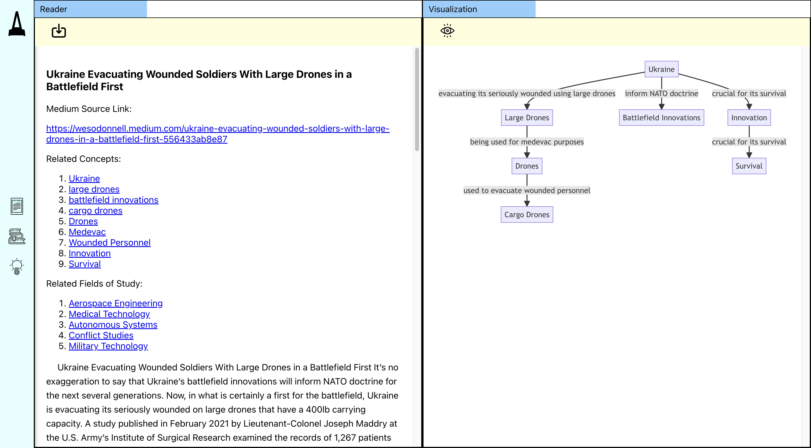

# Visual Learner
<p style="text-align: center;">Visualizing an Article</p>




# Running the application
## Backend
```zsh
cd ./backend
npm run start
```

### Required Environment Variables
| Variable Name        | Description                                                                             |
|----------------------|-----------------------------------------------------------------------------------------|
| MEDIUM_RAPID_API_KEY | A key of API that connects the Medium API service. Checkout the RapidAPI service below: <br/> [Medium RapidAPI Service](https://rapidapi.com/nishujain199719-vgIfuFHZxVZ/api/medium2)  |
| OPENAI_API_KEY       | A key of API that connects the OpenAI ChatGPT Service. Please be reminded that charges may apply based on the usage of the ChatGPT 3.5 model.                                      

## Frontend
```zsh
cd ./frontend
npm run start
```